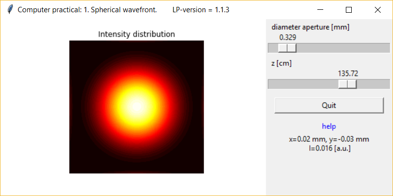

# Education
Optics simulations using the LightPipes optical toolbox are written in Jupyter notebooks. Sudents can open the notebook, read some introduction about the topic and perform some exercises. The simulations can be used as an introduction to real optical experiments in the lab.

The following notebooks are available:

1. **[spherical_wavefront.ipynb](./spherical_wavefront.ipynb)**1. A spherical wavefront is produced by illuminating a small hole with a monochromatic, plane wave. The student investigates the inverse quadratic law by measuring, with the mouse, the intensity at the centre of the beam at several distances from the hole. 
2. 

